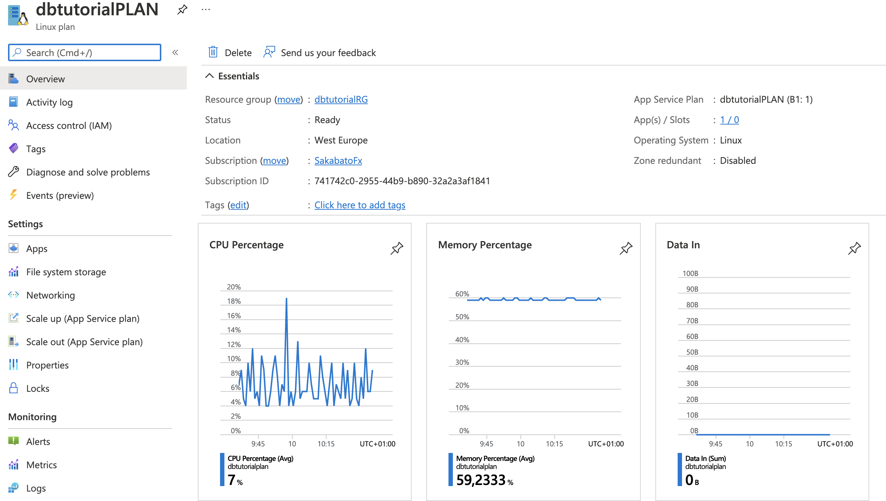
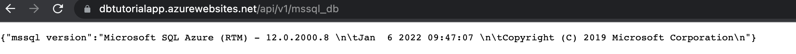

# Tutorial: Connect App Service application to Azure SQL database using managed identity.

### Prerequisites
* [Azure Account](https://azure.microsoft.com/en-us/free/)
* [Azure CLI](https://docs.microsoft.com/en-us/cli/azure/)
or [Azure Cloud Shell](https://docs.microsoft.com/en-us/azure/cloud-shell/overview)

I will create mainly free resources in this tutorial which are in scope of free Azure account.
You can find list of this resources [here.](https://azure.microsoft.com/en-us/pricing/free-services/)

### Overview
  
In this tutorial I will create simple infrastructure in Azure which will contain following resources:
* [Container Registry](https://docs.microsoft.com/en-us/azure/container-registry/)
* [App Service](https://docs.microsoft.com/en-us/azure/app-service/)
* [Azure SQL database](https://docs.microsoft.com/en-us/azure/azure-sql/database/)

I will deploy simple application build with [FastApi](https://fastapi.tiangolo.com/).
Then I will test connection between application and Azure SQL using Managed Identity instead of user and password.

I will use [SQLAlchemy](https://docs.sqlalchemy.org/en/14/core/engines.html) to create connection to database.
```python
from dataclasses import dataclass
from types import TracebackType
from typing import Optional
from typing import Type

import pyodbc
from sqlalchemy import create_engine
from sqlalchemy.engine import URL
from sqlalchemy.orm import sessionmaker

from database_interface.config import db_settings

pyodbc.pooling = False

DATABASE_URL = URL.create("mssql+pyodbc", query={"odbc_connect": db_settings.DB_CONNECTION_STRING})

engine = create_engine(DATABASE_URL)
SessionLocal = sessionmaker(bind=engine, autoflush=False, future=True)


@dataclass
class DBSessionManager:
    def __post_init__(self) -> None:
        self.db_session = SessionLocal()

    def __enter__(self) -> SessionLocal:
        return self.db_session

    def __exit__(
        self,
        exc_type: Optional[Type[BaseException]],
        exc_val: Optional[BaseException],
        exc_tb: Optional[TracebackType],
    ) -> None:
        self.db_session.close()

    async def __aenter__(self) -> SessionLocal:
        return self.db_session

    async def __aexit__(
        self,
        exc_type: Optional[Type[BaseException]],
        exc_val: Optional[BaseException],
        exc_tb: Optional[TracebackType],
    ) -> None:
        self.db_session.close()
```

I will use following variables in this tutorial:
```python
resourceGroup="dbtutorialRG"
registry="dbtutorialACR"
appservice="dbtutorialPLAN"
webapp="dbtutorialAPP"
sqladmin="dbtutorialsqlAdmin"
sqladmingroup="dbtutorialSQLDBAccessGroup"
sqlservername="dbtutorialsqlserver"
sqldb="dbtutorial"

location="westeurope"

DB_CONNECTION_STRING="DRIVER={ODBC Driver 17 for SQL Server};SERVER=$sqlservername.database.windows.net;DATABASE=$sqldb;Authentication=ActiveDirectoryMSI"
```

To avoid errors while provisioning resources to Azure I encourage you to use your own names. For example:

`resourceGroup="dbtutorialRG$RANDOM" `


### Create resource group

`az login`

```yaml
az group create --name $resourceGroup --location $location
```


### Create Container Registry

```yaml
az acr create --name $registry --resource-group $resourceGroup --sku Basic
```


### Clone repo, build and push image to Container Registry

```yaml
git clone git@github.com:adamkielar/fastapi-azuresql-managed-identity.git
cd fastapi-azuresql-managed-identity
az acr build -t tutorial-image:v1.0.0 -r $registry .
```


### Creat App Service Plan
```yaml
az appservice plan create --name $appservice --resource-group $resourceGroup --is-linux --sku B1
```


### Create App Service and enable system assigned Managed Identity
```yaml
az webapp create --resource-group $resourceGroup --plan $appservice --name $webapp --deployment-container-image-name dbtutorialacr.azurecr.io/tutorial-image:v1.0.0
az webapp config appsettings set --resource-group $resourceGroup --name $webapp --settings WEBSITES_PORT=8000
az webapp identity assign --resource-group $resourceGroup --name $webapp
```


### Grant managed identity permission to access container registry

```yaml
subscription_id=$(az account show --query id --output tsv)
principal_id=$(az webapp identity show --resource-group $resourceGroup --name $webapp --query principalId --output tsv)

az role assignment create --assignee $principal_id --scope /subscriptions/$subscription_id/resourceGroups/$resourceGroup/providers/Microsoft.ContainerRegistry/registries/$registry --role "AcrPull"

```

### Configure webapp to use managed identity to pull image from Azure Container Registry
```yaml
az resource update --ids /subscriptions/$subscription_id/resourceGroups/$resourceGroup/providers/Microsoft.Web/sites/$webapp/config/web --set properties.acrUseManagedIdentityCreds=True

```

### Configure which docker image our app service should use
```yaml
az webapp config container set --name $webapp --resource-group $resourceGroup --docker-custom-image-name dbtutorialacr.azurecr.io/tutorial-image:v1.0.0 --docker-registry-server-url https://dbtutorialacr.azurecr.io

```


### Create group in AAD that will have access to SQL server
```yaml
az ad group create --display-name $sqladmingroup --mail-nickname $sqladmingroup
```

### Add webapp service principal to the group
```yaml
group_id=$(az ad group show --group $sqladmingroup --query objectId --output tsv)
az ad group member add --group $group_id --member-id $principal_id
```


### Create a server without SQL Admin, with AD admin, AD Only enabled
```yaml
az sql server create --enable-ad-only-auth --external-admin-principal-type User --external-admin-name $sqladmingroup  --external-admin-sid $group_id -g $resourceGroup -n $sqlservername

```


### Create database:
```yaml
az sql db create --name $sqldb --server $sqlservername --resource-group $resourceGroup --collation Polish_CI_AS --edition GeneralPurpose --family Gen5 --capacity 2

```


### Allow Azure services and resources to access server
```yaml
az sql server firewall-rule create --resource-group $resourceGroup --server $sqlservername --name dbtutorial --start-ip-address 0.0.0.0 --end-ip-address 0.0.0.0

```

### After all needed resources finished provisioning with success I can now add DB_CONNECTION_STRING environment variable to App Service
To improve this solution, environment variable can be stored in [Key Vault](https://docs.microsoft.com/en-us/azure/key-vault/)
```yaml
az webapp config appsettings set --resource-group $resourceGroup --name $webapp --settings DB_CONNECTION_STRING=$DB_CONNECTION_STRING
az webapp restart --resource-group $resourceGroup --name $webapp
```


### Test application

`https://dbtutorialapp.azurewebsites.net/api/v1/mssql_db`



### Clean up and remove resources

```yaml
az group delete --name $resourceGroup 
```
